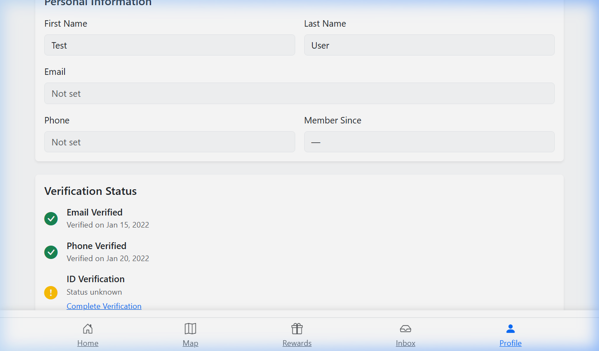
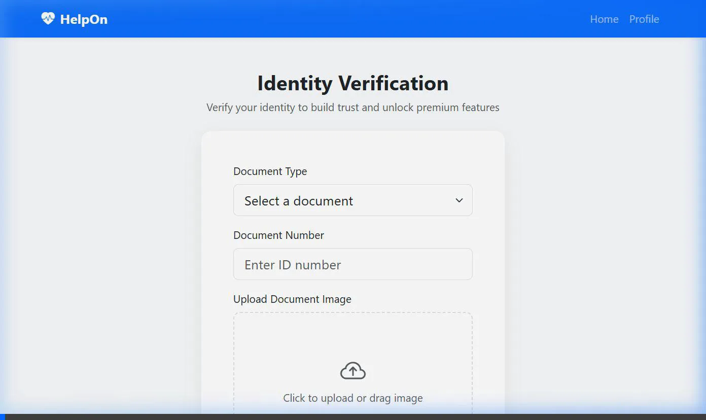
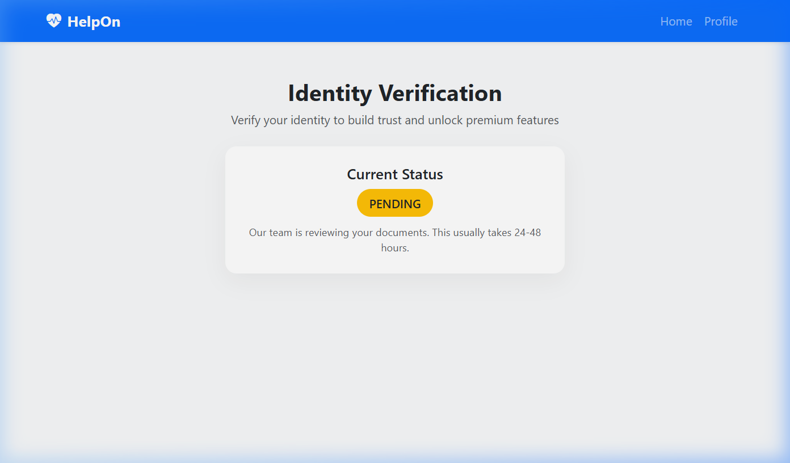

🔰 Project Name: HelpOn
🔎 One-Liner: A serverless, real-time app powered by Supabase that connects people in danger to nearby helpers.

A real-time app that connects people in danger or distress to nearby helpers — faster than waiting for official services.

💡 Problem It Solves

Emergencies (harassment, accidents, panic attacks, theft, getting lost, etc.) often happen in public places.

Police or ambulances can take time, and people around may not realize help is needed.

Many people want to help, but there’s no real-time system to alert or connect them.

🧩 Core Idea

HelpOn creates a network of volunteers and bystanders who can respond instantly when someone nearby triggers an emergency alert.

It’s like a “Zomato of nearby helpers” — but for emergencies, not food.

🧠 How It Works – User Flow
1. ✅ Sign-Up & Roles

> Anyone can sign up as a User, Helper, or both.

> Verified users (KYC approved) receive a blue checkmark badge and can opt into “available to help nearby” mode.

2. 🆘 Triggering an Emergency

> A user can press a 1-tap SOS button from the app.

> They can choose the reason:

> ⚠️ Harassment

> 🚨 Health emergency

> 🧭 Lost/stranded

> 🚗 Road accident

> 🤯 Panic attack or anxiety

3. 📍 Alert Nearby Helpers

> The app locates trusted people within a 300–500m radius.

> Sends:

> 🔔 Push notification with live location

> 🗣️ Live mic/audio stream (optional)

> 📸 Instant selfie or text message

> Helpers can accept the request like a task.

4. 📡 Optional Auto Actions

> Auto-send SMS to emergency contact.

> Call ambulance/police (integrated).

> Trigger loud siren on phone.

5. 👥 Response System

> Nearest helper sees route on map.

> In-app navigation to user.

> On arrival: user confirms safety via OTP or "Safe now" toggle.

6. 📊 Aftermath & Community

> User can rate the response.

> Helper gets points and badges.

> Leaderboard for helpful users (gamification).

> Daily opt-in mode (e.g., “I’m available to help today”).

## 🛡️ Trust & Security (KYC)

To ensure a safe community, HelpOn implements a rigorous Know Your Customer (KYC) and Anti-Cheat system:

### 1. Identity Verification (KYC)
- **Submission**: Users upload government ID (Aadhar, PAN, etc.) via the profile section.
- **Moderation**: Admins manually review documents to verify identities.
- **Badges**: Verified helpers are clearly marked on the map with a blue checkmark.

### 2. Anti-Cheat & Fraud Prevention
- **GPS Spoofing Detection**: The system detects impossible travel speeds (>300 km/h) and ignores fake location updates.
- **Redemption Limits**: Daily cap of 3 reward redemptions per user to prevent point abuse.
- **Device Fingerprinting**: Basic tracking to prevent multiple account creations for fraud.

### 🎬 Demo: How it Works

*Step-by-step: Identity document submission for identity verification.*

*Verification pending state after successful submission.*

## 🚀 Tech Stack Refresh (Migration to Supabase)

HelpOn has recently migrated from a Python/MongoDB/Vercel architecture to a modern, serverless **Supabase** backend.

- **Frontend**: HTML5, Bootstrap 5, Leaflet.js (Maps)
- **Backend-as-a-Service**: [Supabase](https://supabase.com/)
  - **Auth**: Secure user registration and login.
  - **Database**: PostgreSQL for profiles, emergencies, rewards, and support.
  - **Realtime**: Instant SOS alerts and helper location tracking via Postgres Changes.
  - **Storage**: (Planned) User avatars and KYC document uploads.

### Initial Setup for Developers

1. Clone the repository.
2. Create a Supabase project.
3. Run the SQL schema provided in `implementation_plan.md` in your Supabase SQL Editor.
4. Enable **Replication (Realtime)** for the `emergencies` and `profiles` tables.
5. Update `client/config.js` with your Supabase URL and Anon Key.
6. Serve the `client/` folder using any static web server (e.g., `npx serve client`).

