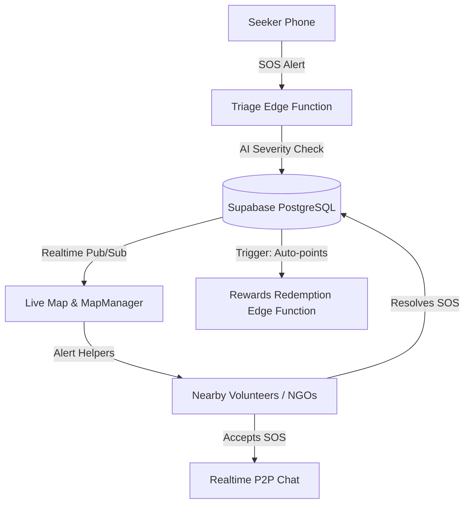

# 🔰 HelpOn — Real-Time Mutual Aid & Emergency Response Platform

[](https://opensource.org/licenses/MIT)
[](https://supabase.com/)
[](https://www.netlify.com/)
[](.github/workflows/deploy.yml)

A serverless, real-time platform that instantly connects people in danger or distress to nearby verified volunteers and community teams. 

HelpOn operates on the concept of **hyper-local decentralized rescue**—bridging the gap in critical minutes before official emergency services arrive.

---

## 🧠 Core Features & Architecture


```mermaid
graph TD
    User[Seeker Phone] -->|SOS Alert| EdgeFn1[Triage Edge Function]
    EdgeFn1 -->|AI Severity Check| DB[(Supabase PostgreSQL)]
    DB -->|Realtime Pub/Sub| Map[Live Map & MapManager]
    Map -->|Alert Helpers| Helpers[Nearby Volunteers / NGOs]
    Helpers -->|Accepts SOS| Chat[Realtime P2P Chat]
    Helpers -->|Resolves SOS| DB
    DB -->|Trigger: Auto-points| Rewards[Rewards Redemption Edge Function]
```

### 1. Real-Time SOS Broadcast & Map Tracking
*   **One-Tap Emergency Alert**: Instantly trigger an SOS with category context (Medical, Danger, Lost, Custom) and optional description/camera attachments.
*   **Live Geospatial Tracking**: Utilizes Leaflet.js and OpenStreetMap on the client to map active emergencies and render real-time volunteer coordinates.
*   **Idempotency Guards**: Enforces double-submission gates client-side (`sosInFlight`) and rate-limits requests server-side.

### 2. Autonomous AI Triage
*   **Edge Function Classification**: SOS broadcasts invoke a Supabase Edge Function (`triage-emergency`) to parse metadata and image attachments using OpenAI Vision APIs (GPT-4o-mini).
*   **Fail-Safe Architecture**: Gracefully falls back to localized regex keyword heuristics on Deno/Edge or client networks if the AI endpoint is unreachable.

### 3. Verification & Anti-Cheat (KYC)
*   **Secure Document Upload**: Securely uploads official government IDs to Supabase Storage.
*   **Verification Gates**: Profile verification state (`kyc_status`) is managed strictly database-side to prevent client-side spoofing.
*   **Blue Checkmark Badges**: Renders trust indicators on map markers for KYC-verified responders.

### 4. Secure Gamification (HelpPoints & Rewards)
*   **Auto-Crediting**: Database triggers autonomously award points to helper profiles on verified SOS resolutions.
*   **Secure Vouchers & Donations**: Vouchers (Zomato, Amazon, Flipkart) and donation project redemptions are transacted server-side via the `redeem-reward` Edge Function. Bypasses direct client insertions to prevent exploits.

---

## 🔒 Security Hardening & Controls

*   **Database Row Level Security (RLS)**: Enforced across all tables (`profiles`, `emergencies`, `messages`, `redemptions`, `organizations`, `support_tickets`). Users can only modify or access records matching their verified `auth.uid()`.
*   **Audit Logging**: Direct updates to sensitive fields (e.g., points, KYC state, roles) are blocked database-side via `restrict_profile_updates` triggers.
*   **Input Sanitization (XSS Defense)**: Global HTML escape wrappers (`escapeHtml()`) sanitize all user-contributed content before injection into DOM lists or map templates.
*   **Edge CORS & JWT Validation**: Restricts Deno Edge Functions to an origin allowlist and decodes authenticated user claims on every request.

---

## 🗂️ Project Directory Structure

```text
├── .github/workflows/       # GitHub Actions CI/CD workflows
├── client/                  # Frontend static files (PWA)
│   ├── css/                 # Styling assets
│   ├── js/                  # App logic scripts (auth, map, sos, telemetry)
│   ├── admin.html           # Admin dashboard and ticket manager
│   ├── chat.html            # Realtime peer-to-peer chat
│   ├── home.html            # Seeker dashboard and SOS console
│   ├── kyc.html             # Identity verification uploader
│   ├── ngo.html             # NGO volunteer cohort dashboard
│   ├── rewards.html         # Reward redemption and point tracker
│   └── service-worker.js    # Offline asset caching and configuration
├── supabase/                # Supabase Serverless configuration
│   ├── functions/           # Deno Edge Functions
│   │   ├── redeem-reward/   # Point transactions & code generator
│   │   └── triage-emergency/# AI vision dispatcher
│   └── migrations/          # Chronological database schema files
├── netlify.toml             # Netlify hosting and security headers config
└── README.md                # Project documentation
```

---

## ⚙️ Local Developer Setup

### 1. Database Setup (Supabase)
1. Create a free project on the [Supabase Dashboard](https://supabase.com/).
2. Run the numbered migrations sequentially from the `supabase/migrations/` directory in your project's **SQL Editor**:
    *   `20260601000100_supabase_ngo.sql` (NGO workflows)
    *   `20260601000200_supabase_chat.sql` (Realtime messages)
    *   `20260601000300_supabase_ai_triage.sql` (Storage bucket & bucket policies)
    *   `20260601000400_supabase_hardening.sql` (Anti-cheat triggers & core RLS)
    *   `20260601000500_supabase_security_patch.sql` (Admin stats RPC & indexes)
    *   `20260601000600_supabase_reward_patch.sql` (Transaction RPC)
3. Ensure **Replication (Realtime)** is enabled for the `emergencies`, `profiles`, and `messages` tables.

### 2. Configure Environment & Deploy Functions
1. Log in to the Supabase CLI in your terminal:
    ```bash
    npx supabase login
    ```
2. Link your local directory to your Supabase project:
    ```bash
    npx supabase link --project-ref <your-project-reference-id>
    ```
3. Deploy the Deno Edge Functions:
    ```bash
    npx supabase functions deploy triage-emergency
    npx supabase functions deploy redeem-reward
    ```

### 3. Local Web Server Configuration
1. Update `client/config.js` with your project's credentials:
    ```javascript
    window.CONFIG = {
        SUPABASE_URL: 'https://<your-project-ref>.supabase.co',
        SUPABASE_ANON_KEY: '<your-anon-key>',
        API_BASE_URL: '/api'
    };
    ```
2. Launch a local web server inside the root directory or serve the `client/` folder:
    ```bash
    # e.g., using python
    python -m http.server 8000
    # or using node
    npx serve client
    ```
3. Open `http://localhost:8000` in your web browser.

---

## 🚀 CI/CD Production Deployment

The project is pre-configured for automated deployment to **Netlify** via GitHub Actions.

### Environment Secrets Needed:
Navigate to your repository settings $\rightarrow$ **Secrets and variables** $\rightarrow$ **Actions** and add:
*   `NETLIFY_AUTH_TOKEN`: Your Netlify Personal Access Token.
*   `NETLIFY_SITE_ID`: Your target Netlify project Site ID.

Pushing changes to the `main` branch will automatically validate, bundle, and sync your frontend client assets directly to Netlify. Security headers (HSTS, CSP, X-Frame-Options) will be set up automatically as defined in `netlify.toml`.
